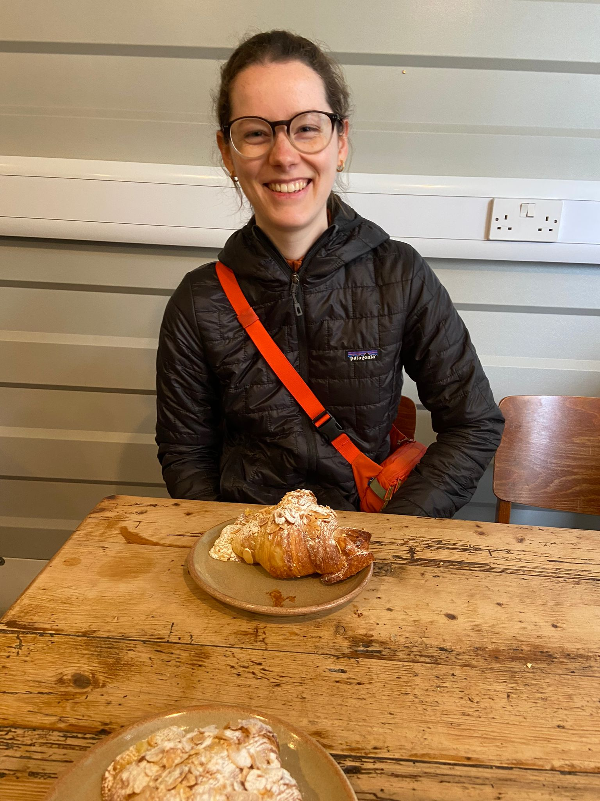

On a rainy thursday morning, Caz got us up and out of the house early for a train up to Newcastle to see family before setting off on the West Highland Way. Obviously we took any excuse to head down to Hart's Bakery, nestled under one of the arches on the approach to Bristol Temple Meads, for a Cappucino and an Almond Croissant.

The Almond Croissants at Hart's are slightly different to other almond croissants as they are not baked as regular croissants and then sliced open, almond filling inserted and rebaked. The almond filling is baked inside from the start.

# Harts Bakery - 26.5/30
**28/03/24 - C**

Category | Score/5
--------|------
Size | 4.5
Crumb | 4
Pastry | 5
Filling | 4
Price | 4
Business | 5

> The filling was good although it had bunched out at the ends of the croissant instead of evenly throughout, this meant we were lacking filling in the centre. The pastry was unbeatable and possibly the best pastry we have had on our adventures. Overall this was a fantastic almond Croissant.

<iframe src="https://www.google.com/maps/embed?pb=!1m18!1m12!1m3!1d2486.498574825263!2d-2.5845146236852257!3d51.44900191496821!2m3!1f0!2f0!3f0!3m2!1i1024!2i768!4f13.1!3m3!1m2!1s0x48718e6344274fc1%3A0x3c3a6f768f6fb6!2sHart&#39;s%20Bakery!5e0!3m2!1sen!2suk!4v1712001789190!5m2!1sen!2suk" width="800" height="600" style="border:0;" allowfullscreen="" loading="lazy" referrerpolicy="no-referrer-when-downgrade"></iframe>